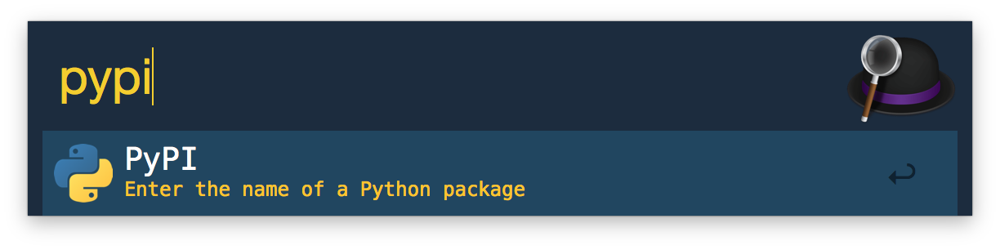
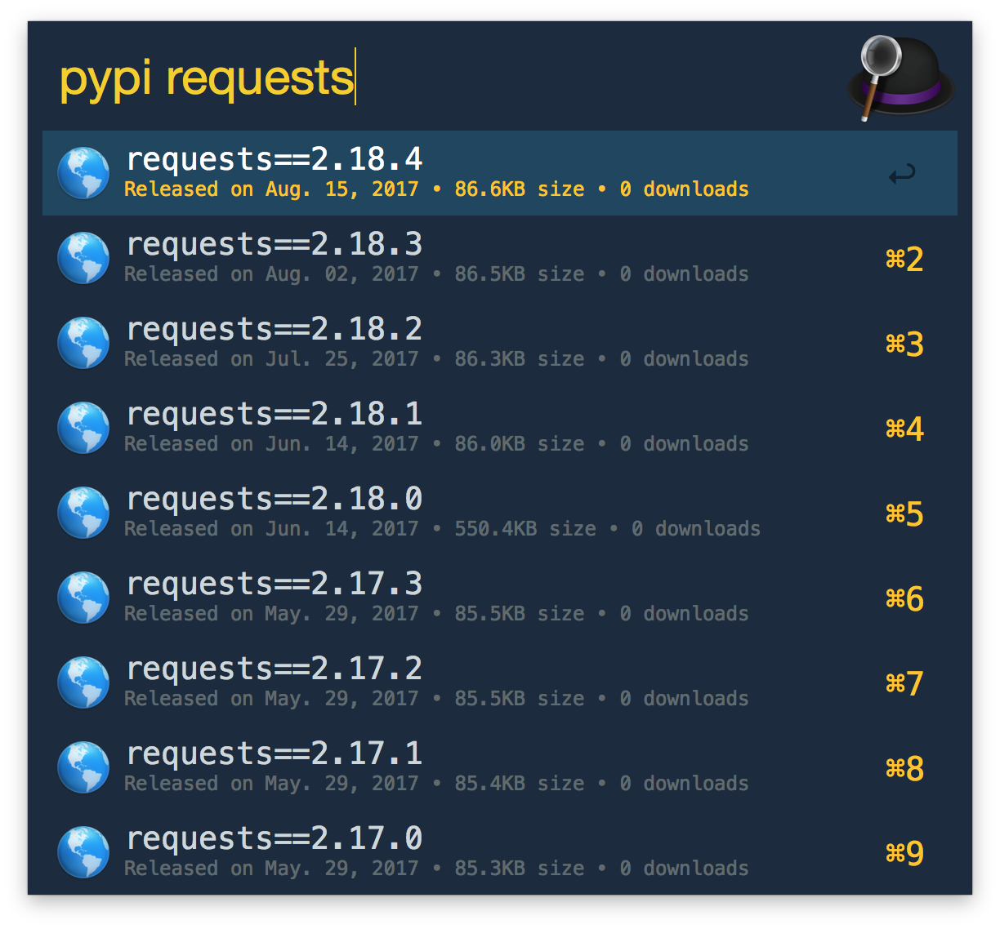

# PyPI-Alfred

An Alfred workflow for looking up Python package versions on PyPI.

## Installation

To install, download and run the [`PyPI-*.alfredworkflow`](https://github.com/grantmcconnaughey/pypi-alfred/releases) file in GitHub.

## Development

PyPI-Alfred works with Python 3.7+ only! Since macOS 12.3 (Monterey) python is no longer part of OS,
therefore python 3 needs to be installed to used this workflow.

This workflow reads data from the PyPI project JSON API. [Click here](http://pypi.python.org/pypi/requests/json) for an example of what that API returns.
